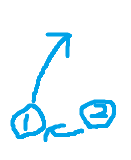

# How to Juggle

Minecraft is a very popular video game. Often, Minecraft players seek to play with their friends on a server. There are several options for playing on other peoples' servers, but to achieve the most personalized experience a new Minecraft server must be created.

## Requirements

- 3 balls, or some kind of throwable objects
- Patience!

## Steps

1. Start with two balls
    - Get two of your throwable objects. Set the other aside for now.
    - Hold one in each hand

2. Begin throwing with your first hand!
    - Throw one of them up in the air with hand 1
    - As it is on its way up, move the other ball from hand 2 to hand
3. Catch the ball with your second hand 
    - This part can be difficult, so don't give up!
4. Repeat steps 1-3 until they can be done consistently and quickly
5. Use 3 balls now.
    - In hand 1 hold 2 balls, and in hand 2 hold 1 ball
6. Throw one of the balls in your first hand
7. 
