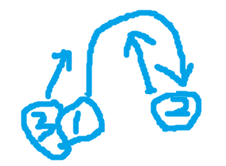

# How to Juggle

Juggling can be a profession, a fun way to kill time, or even just a great party trick. It seems challenging at first glance, but once you start trying to learn, juggling becomes a breeze. Follow these easy steps to learn how to juggle in no time!

## Requirements

- 3 balls, or some kind of throwable objects
- Patience!

## Steps

1. Start with two balls
    - Get two of your throwable objects. Set the other aside for now.
    - Hold one in each hand
2. Begin throwing with your first hand!
    - Throw one of them up in the air with hand 1 towards your other hand
3. As the ball begins to come back down, throw the ball in the other hand
    - a
4. Catch the ball with your second hand 
    - This part can be difficult, so don't give up!
5. Repeat steps 1-3 until they can be done consistently and quickly
    - Your practice with two balls will help you get practice before you move onto 3

6. Use 3 balls now.
    - In hand 1 hold 2 balls, and in hand 2 hold 1 ball
7. Throw one of the balls in your first hand
    - Throw it with a slight bias towards the other hand so you can catch it!
8. As the ball begins to come back down, throw the ball in the other hand
9. Catch the first ball you threw
10. Throw the third ball as the second ball is about to come back down
11. Repeat steps 7-10, keeping 1 to 2 balls in the air

Congratulations! You can now juggle!
